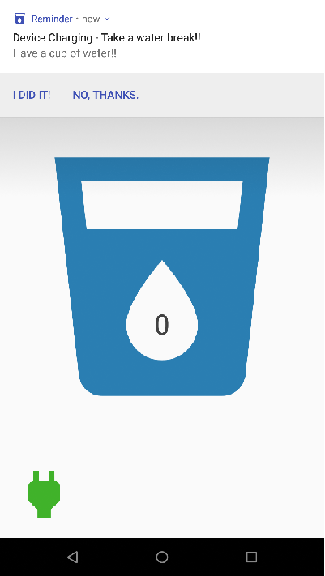
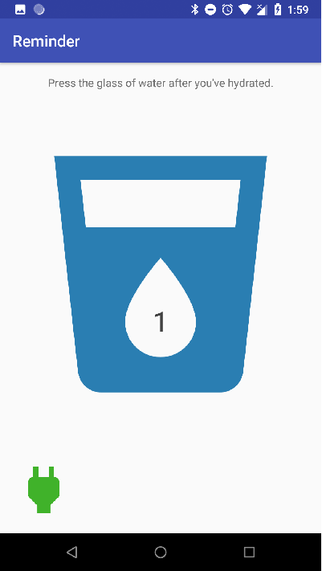

# Reminder

An Android reminder app which sends notification of the hydration task to be reminded every 30 minutes when phone is charging. 
FirebaseJobDispatcher schedules the reminder notification in this app. This project was done as a part of Udacity's Android Developer course.

 |

